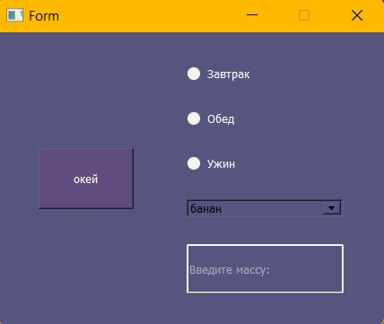

# Calorie-App
Calorie counting app. 
You can select a day in the calendar, make a meal (breakfast/lunch/dinner) and the amount of proteins, fats, 
carbohydrates and calories is displayed for the selected day.

## Functional
Authorization is located on the start screen.

In this version, the program checks for the presence of the entered name in the database.

If there is no name, adds it. If the name is already in the database, a welcome window appears.

After that, the user gets to the calendar page, where he can choose the date of the meal.  

The diary for this day displays meals by time (breakfast/lunch/dinner). 
After clicking on the "Add product"("Добавить продукт") button, an additional window will appear where the user can select the product, the time of the meal and enter the amount eaten. 
After adding the product, the additional window will disappear and to display the entry in the diary, you need to click the "Update"("Обновить") button.
The number of eaten proteins, fats, carbohydrates and calories per day is displayed on top

  

## Database

